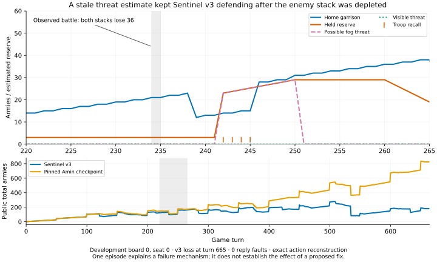

# Sentinel v3: controlled development cycle

V3 remains experimental. The final bounded revision matches frozen v2 on this classic-map sample;
it does not improve its score. Earlier prototypes introduced regressions. Tactical
tests establish intended behavior; these paired games expose its strategic cost.
No seed-113000 final-test observations have been inspected in this work.

All comparisons below use seed 93000, eight classic12 maps, four seat/general-label
cases per map, and an 800-turn cap. Each row contains 32 games per opponent;
there are eight independent map clusters, not 32 independent maps. The four-way
comparison was repeated after each of two corrections, totaling 768 games. Every
candidate action was physically valid and every command was well formed.

| Candidate | Hunter W/L/D | Expander W/L/D |
| --- | ---: | ---: |
| Frozen v2, repeated control | 30 / 2 / 0 | 32 / 0 / 0 |
| Initial v3, full | 30 / 2 / 0 | 30 / 0 / 2 |
| Initial v3, memory only | 30 / 2 / 0 | 28 / 0 / 4 |
| Initial v3, defense only | 30 / 2 / 0 | 30 / 0 / 2 |
| First correction, full | 30 / 2 / 0 | 30 / 0 / 2 |
| First correction, memory only | 28 / 4 / 0 | 32 / 0 / 0 |
| First correction, defense only | 30 / 2 / 0 | 30 / 2 / 0 |
| Final revision, full | 30 / 2 / 0 | 32 / 0 / 0 |
| Final revision, memory only | 30 / 2 / 0 | 32 / 0 / 0 |
| Final revision, defense only | 30 / 2 / 0 | 30 / 2 / 0 |

Strict comparisons verify actual board arrays, rules, action seeds, identical
case keys, and complete map clusters. The initial and first-correction full candidates have an Expander
score difference of −3.125 percentage points against v2; the paired map-bootstrap
95% interval is [−9.375, 0]. Their changed cases occur on different maps. A zero
observed difference against Hunter does not establish general equivalence.

## Initial prototype and causal evidence

Source SHA-256:
`88430e2dc56401d34093411fc322497fb544ad291fa738a240ec896d88ee239c`.
Artifacts and source snapshot: `.cache/runs/sentinel-v3-dev-classic12/`.

The prototype keeps a decaying envelope of possible enemy positions in fog,
clears positions contradicted by current visibility, and expires old threats.
It estimates arrival pressure within twelve route steps and can retain a reserve
for ten turns. Memory and sustained defense are separately switchable; both
disabled preserve v2 actions. Remembered threats never become fabricated cells
in the observation. Nine focused CPU checks passed before the games.

Four selected replays reproduce every outcome, turn, and action counter: both
policies on Hunter board 2, seat 0, swap 0, and Expander board 3, seat 1, swap 0.
The Expander regression first diverges at turn 128: the general has 10, a visible
26-army enemy is twelve route steps away, and the buffered reserve is 14. V3
withdraws the forward army from `(4,7)`. Movement attrition and natural home
growth already cover the enemy's unbuffered arrival. Filling the additional
six-troop buffer causes unnecessary recall.

At turns 128–139, repeated withdrawals reduce owned land from 29 to 20 while the
general grows to 26. By turn 500, army totals are 167 versus 592. The episode
contains 403 defensive overrides but only 17 passes: its principal failure is
repeated withdrawal. V2 wins at 197; v3 draws at 800.

There is also an action-selection defect. At turn 550, home has 107 and the
reserve is 10. V2 proposes a full sortie. V3 rejects it and recalls another troop,
although a half sortie would retain 54 and satisfy the reserve.

The Hunter loss differs: before v3 changes any action, it is already behind
68 versus 104 in army at turn 400. The first policy difference occurs at 409;
184 overrides delay defeat from 629 to 731 without reversing the economic and
frontline deficit. Defensive persistence alone does not solve that loss.

## First bounded correction

Source SHA-256:
`17ddbc00009cc596dd88a282b588a5e6a715e69dda5ed35847ef1949d6f619e1`.
Artifacts and source snapshot: `.cache/runs/sentinel-v3r1-dev-classic12/`.

The correction uses unbuffered demand to trigger recalls, retains the buffer
for sortie safety, chooses a legal safe half sortie when available, and avoids
pulling in extra troops when the garrison is already adequate. Memory decay,
threat horizon, and hold duration are unchanged. Three regression tests were
added; all twelve focused CPU checks passed.

It fixes the original Expander board-3 regression: full v3 wins at 184 versus
v2's 197. However, it turns the board-0 seat-1 placement and its mirror from a
162-turn win into an 800-turn draw, with 296 passes per draw. The memory-only
variant additionally loses Hunter board 4's mirrored placement at turn 75,
where v2 wins at 312. The defense-only variant loses the original Expander
board-3 placement at 701. No ablation demonstrates an overall gain.

The remaining action-selection limitation is structural: vetoing v2's preferred
sortie and passing can repeatedly overlook a useful safe move elsewhere. This motivated one final bounded development revision selecting among actual
scored moves under the defensive constraint. It does not alter observations or
weaken the promotion criterion. Fresh testing and an external-opponent comparison are
still required before any promotion.

## Reproducibility and limits

Each artifact directory contains `manifest.json`, the frozen policy snapshots,
`run_ablations.py`, per-variant boards/CSV/metadata, `paired_analysis.json`, and
`strict-paired-*.json`. Initial replays explicitly record a CLI source difference:
another agent added factory aliases during the already-imported run. Metadata
preserves the initial loaded-source inventory and later disk hashes separately;
the frozen policies were unchanged and replayed outcomes/counters matched.

The initial CPU assignment used 10/11, subsequently identified as SMT siblings
of external-test CPUs 22/23. This does not affect the unbounded local arena's
game outcomes, but overlapping external runtime timings require that contention
qualification. The first correction and subsequent work use CPUs 4/16. Local
matchup wall times are not standalone inference benchmarks. External comparison
results and deployment qualifications are recorded separately by the root run.

## Final bounded candidate-selection revision

Source SHA-256:
`01efd251c426f1c928b9416a26ebc493fde4529219c5980aa155604ca40dc896`.
Artifacts and source snapshot: `.cache/runs/sentinel-v3r2-dev-classic12/`.

The final revision extracts v2's actual full/half move scores into
`_campaign_decision` inside the separate v3 module. An independent review
confirmed all 79 statements before the return are AST-identical to frozen v2;
the return additionally exposes the scored moves. V3 masks moves that violate
its general reserve and selects a positive-scoring safe alternative. Necessary
recalls, immediate rescue, and winning captures retain their existing priority.
The observation is unchanged. This replaces the repeated veto/pass behavior;
it does not change memory decay, threat horizon, or the promotion criterion.

Thirteen focused CPU tests pass, including extracted-action and disabled-v3
parity over 64 engine-derived observations and physical validity of exposed
candidates. The original frozen-v2 source hash remains unchanged. The repeated 256-game development comparison is complete. Full v3 and its
memory-only ablation match v2 on every map score: Hunter 30/2/0 and Expander
32/0/0. Defense-only still loses the mirrored Expander board-3 placement, yielding
30/2/0. No variant produces a positive paired score difference. Full v3 still
loses the same Hunter board-2 placement at 669 versus v2's 629. Mean game lengths
are 386.69 versus 389.63 against Hunter and 194.00 versus 175.63 against Expander.

The final revision repairs both previously diagnosed Expander draw regressions.
It clears this small development regression check, not a superiority test. Full
v3 records 678 Hunter passes versus v2's 362, and 428 Expander passes versus 350,
so conservative behavior remains a measurable cost. This source is frozen for
the separately scheduled competition and external comparisons. Promotion still
requires demonstrated improvement; these classic results alone do not provide it.

## External game-0 diagnosis after the final freeze

The plot uses reconstructed public observations and policy telemetry from this
one completed development episode. The shaded window locates the same period
in the close-up and full-game views; recall marks show the four returning moves.

This read-only audit compares `external-revision2/game-0000.json` with
`external-v2-refresh/game-0000.json` under `.cache/runs/sentinel-v3/`. They use the
same 21×18 board, starting position, rules, and pinned Amin checkpoint. V2 wins
at turn 383; final v3 loses at 665. Both processes have zero protocol faults and
zero skipped observations in both games. Sentinel emits no invalid actions;
Amin's 32 and 53 physically invalid attempts, respectively, are recorded passes,
not missing observations. These are different policy-induced trajectories.

The reconstruction applies the retained **applied** actions to the actual engine.
It uses JAX 0.11.0 and reconstructs Sentinel's observation/memory sequence with
`PRNGKey(player)` and a two-way split per protocol frame. Both final winners,
terminal frames, and turn counts match. All 1,048 Sentinel raw reply vectors
match the reconstructed policy output exactly; sampled wire encode/decode
observations also match. The opponent is not re-executed. The script, state and
telemetry arrays, and verification reports are in
`.cache/runs/sentinel-v3/external-diagnostic/`.

| Turns | Evidence | Interpretation |
| --- | --- | --- |
| 0–241 | Both games have exactly the same applied actions. They exchange the castle at `(13,10)` several times; at 234 a visible enemy stack of 37 attacks our 37 at `(12,10)`. Both stacks lose 36; the visible cells become 1 and public enemy army falls 149→113. | Opening play and early castle trades do not explain the difference between policies. The battle supplies evidence that a previously dangerous army has been depleted. |
| 242–245 | First policy divergence: home has 14; visible threat pressure is 0, but remembered pressure is 23. V3 reverses the convoy at `(6,1)` and returns it through `(6,0)`, `(5,0)`, `(4,0)` to home. V2 sends it forward. | The explicit memory model, rather than an immediate visible attack, triggers the first recall. |
| 242–260 | At 242, the maximum remembered pressure comes from hypothetical 35-army locations `(4,9)` and `(5,8)`, age 16, twelve route steps from home. These derive from the 47-army sighting at turn 226. Pressure rises 23→29 through 250 as the possible region approaches home; the old memory expires at 251 but the held reserve remains. | Location-wise visibility clearing does not associate later sightings and battle losses with every older alternative trajectory. Its aging rule can increase estimated arrival pressure while the underlying remembered force decays. This is a concrete mechanism for excessive defense. The actual largest enemy stack at 242 is only 17, a hindsight fact unavailable directly to the policy. |
| 280–300 | V3 loses its original castle at 280. At 283 it builds at `(12,9)` using a 40-army stack while an enemy 19 is visibly two moves away at `(13,10)`. The enemy approaches and captures the new castle at 284. By 300, v3 trails 170/239 in army with 0/2 castles; v2 has 211/204 and 1/0. | The shared v2 construction heuristic protects against adjacent threats but permits this visibly unsafe two-move investment. This costly mistake occurs on the changed v3 trajectory; it is not a new construction rule introduced by v3. |
| 350–500 | V3 repeatedly loses and recaptures remote castles and continues recalls. At 500 its general holds 108 of its total 272 troops; the enemy has 536. V2 has already won at 383 after reaching the enemy general. | Defensive concentration fails to preserve the production and attack tempo needed to compete with this opponent. V3 never sees the enemy general in its entire episode. |
| 534–665 | A real 136-army attacker hits home's 148 at 534, leaving 13. V3 survives and rebuilds. A later 286-army adjacent attacker overwhelms home 112 on turn 664; defeat is recorded at 665. | The last attack is the terminal mechanism, following a substantial economic deficit. Deathtouch has not activated. |

V3 makes 282 defensive overrides: 173 recalls and 109 productive alternatives.
The final selection correction therefore does not remove the strategic cost of
an overly conservative threat model. The clean protocol reconstruction rules
out missed frames or inference deadlines as explanations for this selected pair.

This evidence supports two weaknesses: stale alternative threat trajectories can
cause unnecessary withdrawal, and the inherited castle heuristic can invest
into a visible two-turn capture. The full-policy comparison establishes a
changed outcome on this board; it does **not** prove that changing only turn 242
would recover the win. No intervention or policy tuning was performed, and this
selected loss does not estimate failure frequency or external rank. The frozen
v3 hash remains `01efd251c426f1c928b9416a26ebc493fde4529219c5980aa155604ca40dc896`;
seed-113000 final-test observations were not inspected here.
